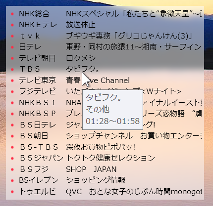

# TVProgram

## 概要
テレビ王国RSSから現在放送中の番組を取得する、テストアプリです。（神奈川仕様）
## 特徴
番組の切り替わり時に1分間色を変えて目立たせます。
## 使い方
起動するだけです。  
テストアプリなので設定等は一切ありません。  
終了するには右クリックします。
## ライセンス
CC0 1.0 Universal

## 注意事項
* 一切責任は持ちません。
* 擦りガラス効果が環境によっては動かないかもしれません（Win10のみ？？）
MainWindow.xaml.csの該当部分をコメントアウトしてください。
